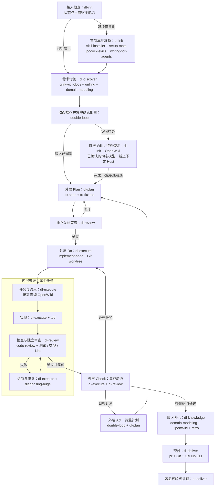

# 阶段技能与双层循环

设计审查必须在任务执行之前完成；形成任务图后可再次由独立审查检查依赖与验收覆盖。知识维护后产生实质代码变化则回到验证，不能把它当作纯收尾跳过检查。一次需求的模型与上下文配置在开始时集中确认，默认终点是 PR。

单独调用 dl-init 时只集中确认其 Wiki Host 配置；由总控首次接入时把它合并到需求后的矩阵，避免重复询问。已初始化项目只核查状态及本次实际能力；源码变化交 OpenWiki 更新，活动队列由原生 begin 恢复。
