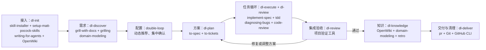

# 执衡 · Zhiheng

[](https://github.com/QZAiXH/zhiheng/actions/workflows/verify.yml)
[](LICENSE)

一套面向 Codex 的中文研发技能：先讨论需求，由主 Agent 根据任务难度推荐模型与上下文，集中确认后自动推进设计、实现、独立审查、OpenWiki 知识维护和 PR 交付。普通测试失败自主修复，涉及新业务取舍或真实阻塞时再询问用户。

本仓库提供九个可组合技能及确定性状态助手。研发方法复用 [Matt Pocock Skills](https://github.com/mattpocock/skills)，项目知识复用 [OpenWiki](https://github.com/langchain-ai/openwiki)；上游正文在接入目标项目时安装，版本由本仓库清单固定。

[快速开始](#快速开始) · [使用说明](使用说明.md) · [阶段流程图](.agents/skills/double-loop/references/workflow.md) · [验证边界](docs/VERIFICATION.md) · [参与贡献](CONTRIBUTING.md)

## 工作方式

外层循环确定方案、集成验收并固化经验；内层循环按任务反复实现、验证、独立审查和修复。



首次接入需要的 Wiki Host 配置可以并入需求后的集中确认；已初始化项目直接核查接入状态。完整流程中的设计审查、任务修复与断点恢复见[逐阶段流程图](.agents/skills/double-loop/references/workflow.md)。

- **动态配置**：技能不写死推荐模型。设计、实现、审查必须使用三个不同的模型，执行角色使用新上下文；主 Agent 保留需求讨论。
- **自动推进**：已确认的需求、配置和交付授权持续有效。常规失败按证据修复，关键范围变化、模型不可用或用户才能提供的条件才升级。
- **项目知识**：OpenWiki Host 亲自串行研究与写页，由引擎管理队列、Claims 和索引；规范需求、ADR 与验收原件保留。
- **交付终点**：默认提交、推送并创建 PR。合并、部署、发版由用户另行明确授权。
- **恢复与清理**：接入状态、单次任务状态和 Wiki 状态分别持久化；只有本次登记且知识已落盘、指纹未变、无保留引用的临时材料才清理。

## 快速开始

### 1. 获取完整技能包

在目标项目目录运行：

```bash
npx skills@latest add QZAiXH/zhiheng --agent codex --skill '*' --copy
```

命令通过成熟的 [Skills CLI](https://github.com/vercel-labs/skills) 安装全部九个技能到当前项目 `.agents/skills/`。`--copy` 保留实际目录，便于初始化助手核查路径和内容；随后在目标项目打开或重新加载 Codex。

也支持交互式入口 `npx skills@latest add QZAiXH/zhiheng`；选择 Codex、项目级安装和全部九个技能。预览清单可以运行：

```bash
npx skills@latest add QZAiXH/zhiheng --list
```

九个技能必须保持在同一父目录；只安装 `double-loop` 会缺少阶段入口。升级前保留现有同名目录与项目接入记录，核对修改后再更新；CLI 的覆盖确认不替代初始化的冲突保护。干净项目的自动化安装可在完整命令末尾添加 `--yes`。

开发者也可以 `git clone https://github.com/QZAiXH/zhiheng.git`，在克隆目录打开 Codex；或通过宿主的官方 `$skill-installer` 将本仓库 `.agents/skills/` 下全部九个目录安装到指定项目级 `--dest`。

### 2. 接入业务项目

已经安装到目标项目时直接请求：

> 使用 $dl-init 接入当前项目。保留已有内容，项目级安装所需技能，生成或增补 AGENTS.md，动态推荐 Wiki Host 配置，并初始化或恢复 OpenWiki。

初始化将安装 15 个固定版本的 Matt Pocock 技能，复制完整九技能包，增补项目指令和精确排除规则，再用 OpenWiki 原生生命周期生成中文项目知识。需要重新加载 MCP 时保存待办，下次恢复。

在克隆目录使用技能、接入另一个项目时，明确目标项目的绝对路径。新增依赖后重新加载 Codex，让技能被发现。非 Git 项目可建立仓库；没有首个提交时会标记 Git 基线待办，进入 worktree 执行前按项目授权处理。

### 3. 从需求推进交付

> 使用 $double-loop 讨论这个需求。讨论结束后按复杂度、风险和当前可用能力推荐设计、实现、审查的模型、强度与上下文；集中确认后连续推进到 PR，并清理符合条件的中间文件。

首次直接使用 `$double-loop` 也会接入项目。需求尚未讨论时先做本地准备，将 Wiki Host 与研发矩阵合并确认；后续阶段沿用确认，不重复采访已明确的需求。

中断后使用 `$dl-resume` 指定目标运行。已有 complete 的运行只报告结果，避免重复发布。

## 技能分工

| 技能 | 用途 | 主要复用方法或工具 |
|---|---|---|
| [double-loop](.agents/skills/double-loop/SKILL.md) | 总控、动态配置、阶段路由 | 本包阶段技能、原生 Agent 调度 |
| [dl-init](.agents/skills/dl-init/SKILL.md) | 接入项目、安装依赖、维护指令、初始化 Wiki | skill-installer、setup-matt-pocock-skills、writing-for-agents、OpenWiki |
| [dl-discover](.agents/skills/dl-discover/SKILL.md) | 需求、范围、验收与取舍 | grill-with-docs、grilling、domain-modeling |
| [dl-plan](.agents/skills/dl-plan/SKILL.md) | 中文规格、任务拆分与依赖图 | to-spec、to-tickets；按需 research、codebase-design |
| [dl-execute](.agents/skills/dl-execute/SKILL.md) | 隔离实现、验证、修复与集成 | implement-spec、tdd、diagnosing-bugs、Git worktree |
| [dl-review](.agents/skills/dl-review/SKILL.md) | 独立设计、代码和验收审查 | code-review、项目测试/类型/Lint |
| [dl-knowledge](.agents/skills/dl-knowledge/SKILL.md) | 固化事实、决策与经验 | OpenWiki、domain-modeling、retro |
| [dl-deliver](.agents/skills/dl-deliver/SKILL.md) | PR 交付与有条件清理 | pr、Git、GitHub CLI |
| [dl-resume](.agents/skills/dl-resume/SKILL.md) | 断点核查与恢复 | 接入记录、运行状态、Git 与 Wiki 队列 |

## 环境与验证

目标环境为 macOS / Linux，Python 3.10+、Git；通过 `npx` 安装需要 Node.js / npm（本次实测 Skills CLI 1.7.1 要求 Node.js 22.20+），交付 GitHub PR 时需要 GitHub CLI 及有效账户权限。仓库开发和 CI 使用 Python 3.12。Markdown 引用解析依赖由 [requirements.txt](.agents/skills/double-loop/scripts/requirements.txt) 固定。

实质执行要求宿主支持显式模型、推理强度、新上下文，并实际提供至少三种不同模型。模型是否可用以当前宿主为准，文件中的配置声明不能代替账户能力。OpenWiki 接入还需要可用 CLI / skill / MCP。

```bash
uv run --with-requirements requirements-dev.txt python -B tools/check_repository.py
uv run --with-requirements requirements-dev.txt python -B tools/run_checks.py --group all
git diff --check
```

已有 **56 项隔离回归测试**，真实固定 upstream 安装及项目级 OpenWiki 集成已另行验证。真实多模型业务调用、完整 Wiki 生成和端到端业务交付仍需在目标项目验证，详见[验证说明](docs/VERIFICATION.md)。辅助脚本不启动模型、代写 Wiki 或自行证明验收成功。

## 仓库结构

```text
.
├── .agents/skills/       # 九个技能、引用、辅助脚本与留存证据
├── .github/             # CI、Issue 和 PR 模板
├── docs/                # 验证与来源说明
├── tools/               # 仓库契约检查与分组回归入口
├── README.md            # 项目介绍与快速开始
├── 使用说明.md          # 使用、接入、恢复与清理说明
├── CONTRIBUTING.md      # 贡献方式
└── LICENSE              # MIT
```

当前 main 的九技能实现替换了早期 `zh-*` 入口与旧 vendor 内容。已有安装需要重新接入并核对同名冲突；历史实现仍可从 Git 历史追踪，不用于当前验收。

## 贡献与许可

通过 [Issues](https://github.com/QZAiXH/zhiheng/issues) 提交问题，通过 [Pull Requests](https://github.com/QZAiXH/zhiheng/pulls) 提交改进。请提供最小复现场景、实际工具结果和验证边界，见[贡献指南](CONTRIBUTING.md)。

本项目使用 [MIT License](LICENSE)，每个技能目录均附带许可证，便于独立安装时保留声明。上游方法、Wiki 与解析器的来源和版本见[来源说明](docs/SOURCES.md)。
