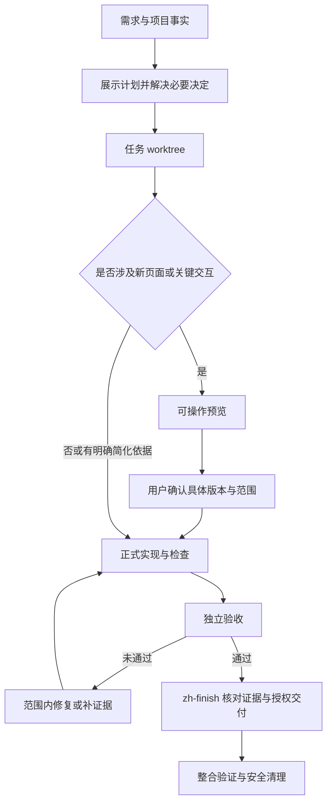

# 执衡 · Zhiheng

## 当前版本与验收边界

面向 Codex CLI 的 v0.5 实现，入口为 `$zh`，完整安装 17 个技能组件。提供显式 local/GitHub 两种模式、原生 Serena 项目知识、MADR 决策、独立审查、预算和交付对账。

**已有真实 local 闭环，尚未完成整个计划验收。** `8ccb840` 的 15 个普通跨平台 CI 作业通过；同版本在 Mac 完成真实 P0、模型实现、Controller 提交、新会话业务审查、5 项测试、本地交付与收尾（D=C）。28 项测试仍暂停，独立安全复核未完成，CI 汇总仍明确不通过。`05d7b47` 增加任务文件改名续跑夹具，本地分片 10/10、入口测试 38/38 通过，其 CI 尚待终态。详见[当前验证状态](docs/VERIFICATION.md)。

这是有限场景的可行性证据，不是生产安全保证、效率收益或所有平台/业务的通过声明。安装与真实执行要求见[完整使用指南](docs/USAGE.zh-CN.md)；[历史验收追踪](vendor/goal-workflow/docs/harness-acceptance.md)保留历次失败和修复，不替代当前状态。

让 AI 开发有计划、有边界、有独立验收，也有明确的交付结果。

执衡是一套面向 Codex 的开发协作技能，保留七个可组合的 zh 技能作为对外入口，底层接入固定 goal-workflow 的十个增强组件。以 `$zh` 为入口，它将项目理解、需求规划、隔离开发、问题诊断、独立审查和收尾交付串联起来，适用于已有项目的功能开发、缺陷修复与重构。

[快速开始](#快速开始) · [完整使用指南](docs/USAGE.zh-CN.md) · [使用示例](#使用示例) · [技能分工](#技能分工) · [安装与恢复](tools/INSTALL.md) · [参与贡献](CONTRIBUTING.md)

## 有什么作用

- **先把事情说清楚**：复杂任务先调查和澄清，再在对话中展示完整计划，包括范围、步骤、分工、验收和交付方式。
- **控制改动范围**：修复本次引入的回归；发现无关的历史问题时记录和说明，避免顺手修改既有业务契约。
- **分开开发与验收**：默认按受控串行流程执行，独立新会话审查实际候选与原始证据；技能切换不能代替会话隔离。
- **按项目合同验收**：后端、前端和文档任务使用各自明确的验收条件；需要浏览器证据时，不能以构建成功替代。
- **明确交付结果**：候选提交后独立验收，证据有效且已授权才交付到目标分支；收尾与清理分别核实，不把停靠当完成。
- **积累可复用的项目知识**：按需保存模块地图、命令验证状态和重要决定，后续任务增量更新。

技能负责协调，增强 Python 控制器负责运行锁、进程与预算、checkpoint、证据过期、Git/平台交付及不确定结果对账。它不替代 Codex 的安全沙箱，也不能自行授予权限；用户授权、独立审查与实际工具证据仍是必要条件。

## 快速开始

### 环境要求

- 支持本地 skills 的 Codex 环境。
- Python **3.11+** 与 uv：安装入口使用标准库；增强执行环境通过独立 uv.lock 固定 filelock、psutil、jsonschema、Markdown，不混入业务依赖。
- Git，用于仓库克隆和开发 worktree。
- 完整开发流程需要宿主支持独立新会话、精确续接和可验证的取消路径；涉及前端时，还需要对应浏览器验收能力。

下面是 Linux、macOS 或 WSL 的 Bash 示例。Windows 用户可在 WSL 中执行；其他环境需按实际 shell 调整路径和命令。

### 安装统一入口与增强组件

`main` 是日常使用与持续开发分支。需要复现验收时，使用[状态页](docs/VERIFICATION.md)列出的确切提交；更新后重新核对当前项目能力和配置。

```bash
git clone --branch main https://github.com/QZAiXH/zhiheng.git
cd zhiheng
python3 tools/validate.py

# 用户级安装：先预览，再安装到 ~/.agents/skills
python3 tools/install-harness.py --destination "$HOME" --dry-run
python3 tools/install-harness.py --destination "$HOME"

# 或项目级安装（替换成实际项目目录）
python3 tools/install-harness.py --destination /path/to/project
```

统一入口仍为 `$zh`。完整安装包括七个 zh 入口和十个增强组件；它们在同一技能目录中协作。只安装文件不代表运行环境、知识 onboarding 或平台验收已经通过。

安装器保留已有未托管同名技能，不覆盖用户修改；如果检测到旧安装冲突，先按[安装与迁移说明](tools/INSTALL.md)处理。不要同时启用原版与增强版同名技能。已有旧版备份仍可使用原恢复工具。

### 本地与 GitHub 模式

必须明确选择模式，有 remote 不会自动变成 GitHub 工作流。

- local：默认不调用 gh、不创建 PR、不推远端；候选经当前证据验证后，按授权交付到本地目标分支
- github：受控发布源分支、创建草稿 PR、读取 CI、按授权转为待审，再依实际规则决定是否允许自动合并
- 私有仓库不要求先购买分支保护。无规则或无权读取规则时保留 PR/CI 工作流，只停靠自动合并；后续人工合并仍须核对真实交付提交

真实模型验收必须显式指定允许的模型与有限调用预算。准备/单元/模拟测试无需模型调用；详情见[宿主验收](vendor/goal-workflow/docs/codex-host-acceptance.md)。

### 开始第一个任务

在你的项目目录打开 Codex，发送：

```text
$zh 为订单列表增加按状态筛选。
目标分支是 main，沿用现有组件和接口约定。
请先展示计划；验收通过后提交并本地合并到 main，清理任务 worktree。
本次不推送远端。
```

根据任务需要回答澄清问题、审阅完整计划；如果涉及新的关键交互，打开预览后确认具体版本和范围。已有有效决定会继续沿用，无需固定的批准口令。

## 技能分工

| 技能 | 何时使用 | 主要结果 |
| --- | --- | --- |
| [`zh`](zh/SKILL.md) | 从需求推进到交付 | 协调阶段、角色、证据和任务状态 |
| [`zh-context`](zh-context/SKILL.md) | 接入项目或刷新项目知识 | 项目地图、命令状态、术语与决定索引 |
| [`zh-plan`](zh-plan/SKILL.md) | 先规划、暂不实现 | 目标、范围、行为切片、依赖、验收与交付计划 |
| [`zh-implement`](zh-implement/SKILL.md) | 执行范围明确的开发任务 | worktree 中的候选改动与检查证据 |
| [`zh-debug`](zh-debug/SKILL.md) | 定位故障或性能回归 | 复现、假设检验、诊断及已授权的修复 |
| [`zh-review`](zh-review/SKILL.md) | 独立验收具体候选 | 按条件给出通过、未通过或无法验证 |
| [`zh-finish`](zh-finish/SKILL.md) | 收尾已获授权且验收通过的任务 | 本地提交与整合、知识保存、工作区清理 |

日常开发通常只需调用 `$zh`。也可以单独调用某一步；单独规划不会自动开始实现，单独 review 不会顺带修复或合并。仅讨论、只读调查和常规运行操作按请求范围处理。

## 使用示例

以下内容发送给 Codex，而不是粘贴到终端执行。将分支名、路径和任务内容换成自己的实际值。

### 初始化项目上下文

```text
$zh-context 接入当前项目，调查并保存后续开发需要的上下文。
优先复用现有文档，记录主要模块、启动与检查命令、已验证结果和知识缺口。
```

这里的初始化是通过原生 Serena 梳理项目知识；已有 `.zhiheng` 与文档保留为来源，不并行维护另一套可写记忆。必要时维护项目规则中的简短指针；它不自动创建应用脚手架、初始化 Git、安装依赖或迁移数据库。只想了解项目而不写文件时，可以明确要求“只读调查”。

### 只制定方案

```text
$zh-plan 评估给项目增加管理员手动关闭和重新开启功能。
先调查现有状态流转，列出需要确认的行为和验收条件，本次只制定计划。
```

### 开发前端交互

```text
$zh 为项目详情增加关闭和重新开启操作，目标分支为 develop。
先澄清权限与关闭后的行为，展示完整计划。
制作可操作预览让我确认，再接入真实功能并做浏览器验收。
通过独立验收后提交并本地合并到 develop。
```

### 诊断问题

```text
$zh-debug 定位订单重复提交的原因，先复现并给出证据。
本次只诊断，不修改代码。
```

如需继续修复，可明确授权范围；需要完整开发和交付时使用 `$zh` 衔接。

### 独立审查与交付

```text
$zh-review 独立审查这个候选。
基线：<基线提交>；候选：<候选提交或完整文件范围>；worktree：<路径>。
需求与必要决定：<材料路径>；原始检查证据：<材料路径>。
```

首次审查需要独立新会话，只传必要需求、规范、候选和原始证据。在原开发对话中换用 `$zh-review` 并不自动获得独立上下文；通过 `$zh` 发起时由入口安排独立审查。

```text
$zh-finish 按已确认范围完成任务 <任务标识> 的收尾。
目标分支为 develop，任务 worktree 为 <路径>。
独立验收报告和原始证据见 <路径>。
提交本次变更、本地合并、执行整合检查，并清理任务 worktree。
```

若还要推送，需明确授权，例如“将验收后的 develop 推送到 origin”。本地合并、远端推送、创建 PR 和发布是不同操作；技能沿用已有授权，不从其中一个自动推导另一个。

## 工作流程



小而明确的任务可以用简短计划，由主 agent 实现。复杂任务的主 agent 负责调查、澄清、计划协调、证据核对和交付；开发、修复以及实现测试交给执行子 agent。模型与推理强度按宿主实际可用配置及任务风险选择，不固定型号。

前端可在已有明确设计或已确认业务交互的范围内简化预览，但复用组件、样式或通用弹窗不代表新业务交互已确认。原型可以使用模拟数据；正式验收需对照确认依据，核实真实操作与结果。详见 [前端预览与验收](zh-implement/references/frontend-preview.md)。

## 记录与辅助工具

项目长期知识优先复用现有文档；开发任务的范围、决定、检查证据与恢复指针按 [任务记录规则](zh/references/records.md) 保存。

增强任务统一使用 `goal-harness` 的运行记录与 `.loop-state.json`。按[命令速查](docs/USAGE.zh-CN.md#5-终端命令速查可选)操作，不为同一任务并行运行旧 `zh/scripts/task.py` 状态机；旧工具仅保留明确的历史兼容用途。

新项目草稿推荐显式 `controller_commit`：模型仅修改已批准文件并测试，Controller 在审计后提交任务源分支。逐文件 `allowed_paths`、当前能力收据、合同和独立审查都不可省略。worktree 不是 OS 沙箱。实现超时会保留脏工作区并 blocked，当前没有自动续接脏实现入口；`recover` 只核验执行停止。详见[提交职责与故障处理](docs/USAGE.zh-CN.md#6-暂停恢复与故障定位)。

## 常见问题

**必须每次先初始化吗？** 不需要。已有上下文可复用，仅在缺失或过时时按需更新。

**没有子 agent 或浏览器能力怎么办？** 仍可按范围调查、规划和处理不依赖这些能力的工作。复杂开发缺少委派能力、独立验收缺少新会话，或前端关键路径无法验证时，需如实记录受阻；不能把自评、构建成功或截图当作全部验收通过。

**会顺手处理其他失败的测试吗？** 先区分本次回归、历史问题和环境问题。范围外的问题应记录，不应修改旧断言来掩盖未经授权的业务变化。

**原工作区有未提交修改怎么办？** 保留原处。需要依赖这些内容时先明确纳入范围与转移方式；不能隐式 stash、覆盖，或用回填文件绕过脏目标分支。详见 [工作区规则](zh/references/workspaces.md)。

**这是可直接上传的插件吗？** 当前仓库以本地 skill 目录和 Python 工具分发，没有插件 manifest；按本文安装整个技能集合即可。其他 agent 宿主的技能发现、委派与浏览器能力需自行适配和验证。

## 仓库结构

```text
.
├── README.md             # 使用入口
├── CONTRIBUTING.md       # 贡献与验证说明
├── LICENSE               # MIT 许可
├── zh/                   # 协调入口、共享参考与 task.py
├── zh-context/           # 项目接入与知识维护
├── zh-plan/              # 需求与实施计划
├── zh-implement/         # 开发、前端预览与验证参考
├── zh-debug/             # 故障诊断
├── zh-review/            # 独立验收
├── zh-finish/            # 收尾与交付
├── tools/                # 安装、恢复、结构校验
├── tests/                # 入口、安装与旧任务兼容回归
├── vendor/goal-workflow/ # 增强引擎、锁定依赖、完整验收追踪
└── .github/              # 跨平台验证及 Issue/PR 模板
```

## 贡献与反馈

欢迎通过 [Issues](https://github.com/QZAiXH/zhiheng/issues) 反馈问题或提出建议，通过 [Pull Requests](https://github.com/QZAiXH/zhiheng/pulls) 提交改进。请先阅读 [贡献指南](CONTRIBUTING.md)，提供可复现的场景、实际行为和必要的脱敏证据。

## 许可与来源

本仓库使用 [MIT License](LICENSE)。部分方法参考并改写自 [mattpocock/skills](https://github.com/mattpocock/skills/tree/c55ee46073ed923f86ce59a5eb3b6d895095d1b7)，保留其版权和许可声明；具体来源与改写范围见 [来源说明](zh/references/provenance.md)。
