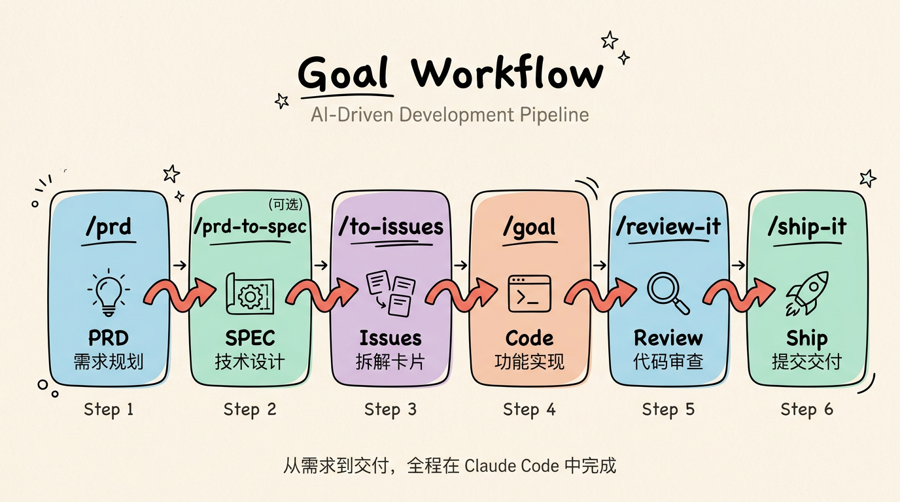

# goal-workflow

## Codex CLI Harness 增强版（开发与验收中）

本分支依据 2026-09-30 v0.5 计划增强上游 `b06ab3c1c147dcf7ef8dd62a8927cd506d098135`，第一宿主为 Codex CLI。保留原技能链，新增 `harness-init`，固定 `local` / `github` 模式；执行控制、真实检查、组合基线、恢复和知识接入分别验收。当前可用能力与未完成实测必须以验证报告为准，不把本节或模拟通过视作 P5 发布验收完成。

- [逐项验收与未完成实测](docs/harness-acceptance.md)
- [同基线双模式 CLI 夹具比较](docs/p5-simulated-cli-comparison.md)：local 3/3、GitHub 5/5；Git/Serena/业务检查真实，宿主及 GitHub 运输明确模拟，收据仍为 simulation_only。真实 Mac/GitHub 分项观测不能替代完整双模式 P5
- [共享运行合同](skills/harness-init/references/workflow-contract.md)
- [Serena / MADR 固定来源与知识边界](skills/harness-init/references/knowledge.md)
- Codex 技能使用 `$harness-init` / `$loop-it` 等入口；下方 `/...` 是上游 Claude 使用示例，不能据此假设 Codex 存在 `/goal` 或 Claude 的 Skill 工具
- 默认在 verified 停靠，推送/合并/部署不能仅由技能文本推导授权


English | [简体中文](./README_CN.md)

An AI-driven development workflow — from PRD to shipped code, all within Claude Code.

```
/prd  →  /prd-to-spec (optional)  →  /to-issues  →  /loop-it (→ /goal → /review-it → /note-it → /walkthrough → /ship-it)×N
```

<p align="center">
  
</p>

## Installation

```bash
npx skills add smallnest/goal-workflow
```

## Skills

| Command | Description |
|---------|-------------|
| `/prd` | Generate PRD (requirements document) |
| `/prd-to-spec` | Transform PRD into technical SPEC (optional) |
| `/to-design` | Generate a design proposal from a PRD (Go-proposal style) |
| `/to-issues` | Decompose PRD/SPEC into Issues and create tickets |
| `/loop-it` | Batch-implement all open Issues with checkpoint/resume |
| `/graph` | Turn a task/PRD into a dependency graph and implement nodes in parallel |
| `/goal` | Implement an Issue end-to-end (Claude Code built-in) |
| `/review-it` | Automated code review with iterative fixes |
| `/understand` | Turn fresh (AI-generated) changes into an interactive review webpage |
| `/ship-it` | Commit, PR, merge, and close the Issue |
| `/note-it` | Capture implementation notes per Issue |
| `/walkthrough` | Phase-2 walkthrough: change summary, verification proof, visual evidence, review gate |
| `/humanize-it` | Remove AI traces from documents |
| `/article-icons` | Illustrate an article with inline SVG icons |
| `/listenhub-tts` | Text-to-speech via ListenHub |
| `/insight-diagram` | Generate UML and architecture diagrams |
| `/design-it` | Turn a requirement into a self-contained HTML design document |
| `/code-to-spec` | Reverse-engineer SPEC from existing projects |
| `/refactor` | Expert code refactoring (Fowler catalog) |
| `/modern-go` | Modernize Go code (35+ gofix-style rules) |
| `/smell` | Detect architecture anti-patterns, code smells, and complexity hotspots |

## Documentation

Full usage guide: [docs/index.html](docs/index.html)

## License

MIT