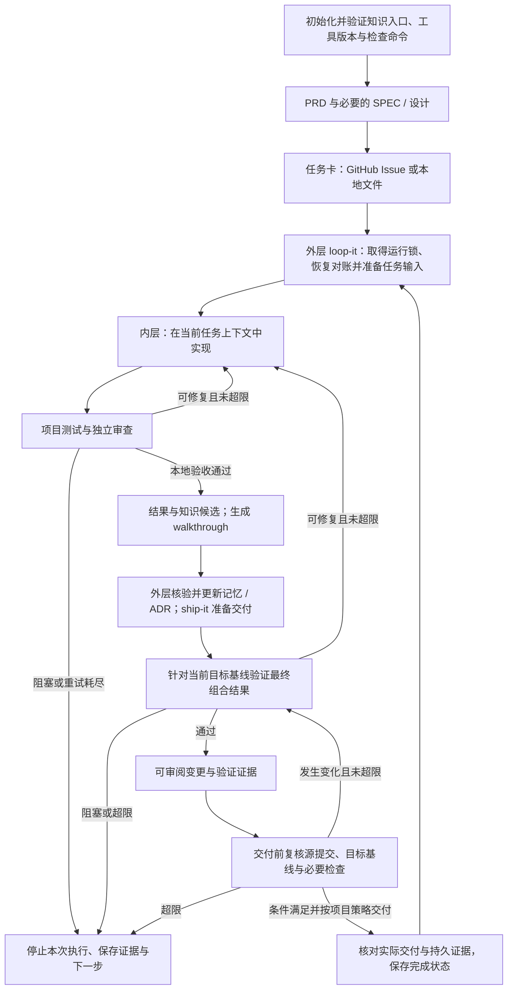

# goal-workflow ×《Agent 驾驭工程之美》集成计划

版本：评审稿 v0.5　日期：2026-09-30　状态：实施计划已补齐，工作流尚未实施。首版同时适配 **GitHub 和本地两种模式**，分别完成端到端验收；GitLab、Gitea 等平台留待后续。本版将知识初始化、运行互斥、合并基线、本地报告、超时取消和长期证据六项审查意见落实为实施任务、依赖与验收用例。项目知识优先复用 Serena，重要决策复用 MADR。

建议以 goal-workflow 为主干，维护一个便于同步上游的小型增强分支，把课程中的验收、上下文、知识、状态和环境管理落实到现有技能之间的接口。首版交付一个共享核心流程、具有 GitHub 和本地两个运行入口、能在流程内拦截未达标交付并从中断恢复的串行工作流。本地模式也可用于托管在其他平台的代码仓库，但首版不调用这些平台的 Issue、MR 或 CI API。增强分支可维护在内部仓库，无需使用 GitHub 的 Fork 功能。

依据是截至 2026-09-29 已通读的开篇词及 01—18 讲全部正式正文，直播不纳入计划依据；当时尚未发布的课程内容后续增量评估。仓库基线为 [b06ab3c](https://github.com/smallnest/goal-workflow/commit/b06ab3c1c147dcf7ef8dd62a8927cd506d098135)，并参考[官方中文指南](https://goal.rpcx.io/index_cn.html)。详细依据见[课程阅读记录](../research/course-reading-notes.md)、[源码核查](../research/goal-workflow-source-review.md)、[可行性分析](../research/goal-workflow-harness-feasibility.md)和[知识维护方案选型](../research/knowledge-maintenance-options.md)。下文均为拟实施设计；外部项目的现成功能不等于 goal-workflow 已经集成。

## 1. 首版范围与关键选择

| 事项 | 建议选择 | 原因 |
|---|---|---|
| 集成载体 | goal-workflow 的增强分支，加业务仓库内的项目配置与薄适配脚本 | 保留原有技能体验，使通用修复可以独立回馈上游 |
| 试点范围 | 一个实际使用的 Agent 宿主；GitHub、本地两种模式；串行执行 | 复用核心流程，并分别验证平台协作和本地运行 |
| 工作流主干 | 复用 prd → 可选 SPEC/设计 → to-issues → loop-it → review-it → walkthrough → ship-it | 保留已有任务切片、审查和交付能力 |
| 新增入口 | 一个拟新增的 `harness-init` 薄封装 | 调用现成初始化入口、定位已有资料并保存运行配置；不自行实现知识初始化引擎 |
| 完成判定 | 验收条目、真实工具结果、独立审查和实际 Git/平台状态共同判定 | 模型的完成声明只作为待核实输入 |
| 交付方式 | GitHub 模式生成可审阅 PR；本地模式生成验证过的分支、提交和说明，默认不推送 | 两种模式先提供可审阅结果，再按项目策略完成交付 |
| 状态与知识 | 进度复用 checkpoint；项目记忆复用 Serena；重要决策复用 MADR | 知识文件随代码评审和回退，避免新造存储格式、检索和决策模板 |
| 并行 graph | 首版验收通过后接入 | 复用首版的数据合同、验证和恢复机制 |

首版覆盖通过 Git 交付的研发任务，对外提供 `github`、`local` 两套完整模式配置。其他平台适配、跨模式任务同步、跨机器调度、多宿主统一平台、向量知识库和生产部署暂不进入交付范围。小改动可直接形成任务卡；只有涉及接口、状态模型或重要取舍时才生成完整 SPEC、设计提案或 ADR。

### 组织约定的来源与选型

已有项目规则和文档结构优先。新增约定先查现成实现，说明来源、版本和适用边界；仅在工具之间确有缺口时编写适配。课程用于判断应解决的问题，工具的真实接口决定如何落地。

| 原拟自行设计的部分 | 当前复用选择 | 边界 |
|---|---|---|
| `KNOWLEDGE.md`、模块知识索引和维护协议 | [Serena v1.7.0](https://github.com/oraios/serena/blob/v1.7.0/docs/02-usage/045_memories.md) 的 `.serena/memories/`、`mem:` 引用及原生维护模板 | 使用完整发布包的 MCP/CLI；不复制源码另造一个记忆组件 |
| 自拟 ADR 结构、决策状态及替代关系 | [MADR 4.0.0](https://github.com/adr/madr/blob/4.0.0/template/adr-template.md) | 复用模板的背景、候选方案、理由、后果、确认方式和状态；正文中文化 |
| 强制新增 `PRINCIPLES.md`、`SOURCES.md` | 沿用项目已有 `AGENTS.md`、PRD/SPEC 和资料链接 | 无治理模板时才考虑复用 Spec Kit 的 constitution 模板；首版不引入第二套规范编排 |
| `knowledge-delta` JSON 及知识生命周期 Schema | 复用 `note-it` / `walkthrough` 的发现与证据，收尾调用 Serena 原生工具 | 只在任务结果中保留文档引用，不另设知识交换协议 |
| 自动判定知识过期、自动消解语义冲突 | 原生引用检查，加受影响知识的证据复核 | 引用存在不代表结论正确；语义复核仍需 Agent/人结合代码、规范和测试判断 |

本次比较了 Serena、Basic Memory、MADR、Spec Kit、OpenSpec、Mem0、Graphiti。Serena 与 MADR 是本计划的首选组合；Basic Memory 是需要结构化知识关系和搜索时的替代候选，首版不同时维护两套可写知识源。其他候选的版本、维护证据和取舍见选型文档。Serena 在实际宿主中的接入仍须通过 P0。

## 2. 集成后的运行方式



外层决定任务顺序、预算、依赖和持久状态；内层实现当前任务并回传结果；验证者核对要求与证据。它们是职责边界，实际运行复用宿主已有的会话或子任务能力。P0 必须验证宿主怎样创建新上下文、运行审查和续接任务，不能把提示词中的“新会话”当作已经实现的隔离。

确定性操作交给工具：读取依赖、检查结构、运行测试、保存状态、查询 Git/评审/检查结果。语义判断交给 Agent 或人：需求是否完整、设计取舍是否合理、发现是否值得固化。需要服务器端强制合并条件时，接入目标平台已有的检查、评审和分支规则，并在 P0 核实实际能力。

若配置为人工合并，流程在可审阅变更就绪处保存交接并停靠；确认执行者和子进程停止后释放运行锁。恢复时重新取得锁、对账引用与检查，再判断实际交付是否完成。PR 状态、验证状态、交付状态和任务完成状态分别记录，本地模式不伪造 PR 状态。已排队或已开启自动合并的远端操作也要记录，停靠不等于它们已被取消。

### 平台适配边界

Git 的分支、提交、diff、worktree、fetch/push 统一复用 Git CLI。任务管理、变更评审和检查结果分成三个小型适配接口，首版提供 GitHub、本地两套固定组合；接口保持可替换，跨组合混用在后续按需求扩展。核心任务循环不直接调用 `gh`，也不以 GitHub Issue 编号作为通用任务 ID。

| 接口 | 提供给核心流程的能力 | 需要归一化的差异 |
|---|---|---|
| 任务来源 | 列举/读取任务、获取依赖、回写完成结果或生成状态展示 | GitHub Issue 与本地 Markdown；编号、分页、依赖和关闭原因 |
| 交付与评审 | 查找/创建/更新 PR、查询合并状态；或准备本地 Git 交付 | 有无 PR；目标分支、合并方式、重复操作识别 |
| 验证与证据 | 运行或查询检查，返回提交、结论及证据 | GitHub 检查结果与本地命令；通过/失败/跳过/未知及证据保留 |

仓库和任务标识带上模式、仓库标识及任务 ID；GitHub 标识另含平台实例和项目，本地任务使用稳定 ID。本地 Markdown 保存任务定义、验收和依赖，运行进度由统一状态存储维护；任务列表中的运行状态从该存储生成，避免另设一份权威进度。适配器声明是否支持原生依赖、PR、检查查询和合并限制；认证失败、查询失败不能被解释为无依赖或检查通过。

| 能力 | GitHub 模式 | 本地模式 |
|---|---|---|
| 任务来源 | GitHub Issue | 仓库内 Markdown 任务文件 |
| 依赖 | 原生依赖优先，兼容既有正文格式 | 文件中以稳定任务 ID 显式声明依赖 |
| 代码操作 | Git CLI | 同一套 Git CLI 操作 |
| 验证 | 本地检查、独立审查及当前提交的 GitHub CI/checks | 配置的本地检查命令、独立审查和结构化报告 |
| 可审阅结果 | PR、walkthrough 和验证证据 | 本地分支、提交、walkthrough 和验证证据 |
| 交付核对 | PR 合并结果、目标分支和 Issue | 目标分支及实际提交、本地任务与报告 |
| 恢复 | 查询 Git、Issue、PR 和 CI 后对账 | 查询 Git 引用、任务快照、报告和 checkpoint 后对账 |
| 认证与远端 | 需要 GitHub 仓库访问权限及 gh 认证 | 不要求 GitHub 账号、gh 或 Git remote |
| 推送 | 按项目流程推送 GitHub 分支 | 默认关闭；显式配置后可通过 Git 推送指定 remote |

`harness-init` 在 `.harness/config.json` 中保存明确的 `mode: github` 或 `mode: local`。每次运行固定模式；不能因检测到 GitHub remote 就把本地模式切成 GitHub，也不能在 GitHub 认证失败时自动改成本地。模式写入 checkpoint，恢复时不匹配则要求使用匹配配置或建立新运行，避免混用任务与状态。

原版 `to-issues` 已提供 [Local 任务文件模式](https://github.com/smallnest/goal-workflow/blob/b06ab3c1c147dcf7ef8dd62a8927cd506d098135/skills/to-issues/SKILL.md#L163)，直接复用其模板并补充稳定 ID 与依赖协议。当前 `loop-it` 和 [ship-it](https://github.com/smallnest/goal-workflow/blob/b06ab3c1c147dcf7ef8dd62a8927cd506d098135/skills/ship-it/SKILL.md) 主要依赖 GitHub/gh，需要抽出调用，并增加本地分支；两种模式均是首版交付要求。

本地模式覆盖完整的需求、实现、验证、恢复和知识归档，不要求托管 CI，也不创建 PR。两种模式默认都先停在 verified，后续按项目策略交付；对于要求合入的代码任务，GitHub 核对 PR 和目标分支，本地核对本地目标分支包含已验收的变更。仅产生一个功能分支不能自动解除需要合入成果的下游依赖。

本地模式不要求 GitHub 或远端仓库网络访问；Agent 模型、业务依赖或测试服务是否需要网络由项目环境决定，因此不将“本地”表述为整个系统完全离线。只有本地检查时，由工作流检查控制停靠，不宣称具有服务器端强制合并限制。

## 3. 分阶段实施

先在 P0 核实实际宿主、现有测试、选定组件及下列补充任务，再估算 P1—P5。复用组件减少自行实现的范围，但仍需计算安装、版本兼容、恢复演练和两种模式验收的成本；P0 的结果包含修订工期。

| 阶段 | 主要工作 | 交付物 | 退出条件 |
|---|---|---|---|
| P0：固定基线与验证选型 | 确定宿主、两种环境；演练知识梳理、停止执行、基线校验及证据保存 | 能力清单、同一基线的试点任务集、运行限额与保留策略、修订工期 | 实际宿主完成知识读写和停止演练；GitHub 合并检查路径明确；本地无 remote 场景可准备 |
| P1：修复前置缺陷 | 修正 review helper、失败分支、依赖读取和文档不一致 | 可独立回馈上游的修复及回归用例 | 失败退出码不丢失；重试耗尽不进入交付；原生依赖不被遗漏 |
| P2：复用组件与薄适配 | 定义任务合同；提供两种配置；实现运行互斥、有限等待、原生 onboarding 和报告定位 | `harness-init`、任务 Schema、组件调用、锁及执行入口、模式化报告模板 | 知识入口可读；重复启动不能进入执行；限额可校验；用户修改保留；本地不检查 gh |
| P3：串行执行与验收 | 先接通本地流程，再接 GitHub；接入按需读取、收尾知识更新、组合验证及可持久引用的报告 | 增强原技能、两种模式适配、验收汇总及交付前复核 | 相同小功能在两种模式形成合格结果；源或目标变化使旧验证失效；长期知识依据可访问 |
| P4：恢复与交接 | 验证异常退出后接管、超时取消、外部操作对账和证据清理后的知识读取 | 恢复入口、故障演练结果、证据保留与清理规则 | 不重复交付；旧执行停止后才接管；不误杀无关进程；临时材料清理不切断长期依据 |
| P5：试点与发布 | 两种模式各跑真实任务和故障场景；验证安装、升级、回退 | 分模式报告、发行物、迁移与回退说明 | 共享验收和模式专属验收均通过；耗时与人工介入分别记录 |
| P6：可选并行 | graph 复用相同接口；隔离共享资源；合并后重新验证组合结果 | 并行适配及冲突/中断测试 | 多分支单独通过与合并后整体通过分别验证；失败不污染其他任务 |

依赖顺序为 `P0 →（P1、P2）→ P3 → P4 → P5`。P1 和 P2 可以独立推进；运行互斥和停止入口必须先于 P3 的有副作用执行接通。P3 先跑通本地共享流程，再接入 GitHub。P5 的两种模式均通过才启动 P6，首版不能只发布其中一种模式。

### 六项补充实施任务

以下六项纳入首版工作量。任务编号只用于本计划及验收追踪；任务卡仍复用 `to-issues` 的现有模板，不引入新的组织协议。各项由实施者提交结果，验证者按第 7 节验收；实际人员和宿主在 P0 落实。

| 任务 | 修改位置与交付物 | 阶段及前置依赖 | 完成条件 |
|---|---|---|---|
| 补充 1：知识初始化与渐进读取 | `harness-init`、`loop-it` 的原生 onboarding/读取接入；知识就绪检查 | P0 演练、P2 接入；依赖宿主和 Serena 版本确定 | 完成项目梳理与真实写入；只有维护模板不能通过；任务可沿入口逐层读取，验收条件保持完整 |
| 补充 2：运行互斥与异常接管 | 复用 filelock 的运行入口、checkpoint 写入 helper、恢复入口 | P2 实现、P4 演练；依赖 P0 的操作系统及文件系统核查 | 同仓库受控工作区只允许一个执行者；崩溃后先核实旧执行停止，再对账接管 |
| 补充 3：目标基线与组合验证 | `ship-it`、GitHub 检查适配、本地 Git 交付适配和证据映射 | P3；依赖 P1 的失败处理及补充 2 的互斥 | 源提交或目标基线变化会阻止沿用旧证据；实际交付对应已验证组合结果 |
| 补充 4：本地报告与任务标识 | `note-it`、`walkthrough`、`ship-it` 的参数及报告模板 | P2—P3；依赖本地稳定任务 ID 与报告目录确定 | 非数字任务 ID 可生成、更新及链接报告；本地无需 Issue/PR；GitHub 原格式仍兼容 |
| 补充 5：超时、预算与取消 | 共享执行 helper、宿主调用、CI 等待及恢复入口 | P2—P4；依赖 P0 的停止能力核查及补充 2 | 所有等待有界；超时或取消不进入交付；确认本次子进程停止；远端结果未知时先对账 |
| 补充 6：长期证据与清理 | 复用 walkthrough/ADR 的证据引用、既有归档设施和收尾检查 | P3—P4；依赖补充 1、3、4 | 长期知识有可持久访问的依据；清理运行目录、复制仓库后仍可核实；无持久依据的候选不晋升 |

P5 将六组补充验收与原矩阵一起执行。不能以“文档已补齐”或单个组件探针通过代替实施完成。

### P0：固定实际运行条件

记录宿主产品及版本、模型标识、操作系统、Git、GitHub/gh 版本与能力、项目运行时、现有锁文件、验证命令、技能来源提交及有效加载位置。GitHub 侧核实 Issue、PR、CI 与合并规则；本地侧核实任务目录、报告目录、目标分支和不依赖 remote 的执行路径。模型与外部服务的版本信息能取得多少记录多少，复现目标是输入、环境和验证过程可追溯。

同时落实：运行锁的唯一位置与原生锁后端、宿主执行/停止句柄、本地子进程识别方式、各步骤超时和尝试上限、CI 等待上限、停止宽限期、报告映射与长期证据位置。GitHub 明确采用严格状态检查或已有合并队列；确认 CI 实际测试哪个提交，队列模式还需验证 `merge_group` 检查。若无法保证目标基线的校验，记录能力缺口并停在可审阅结果，不开启自动合并。未核实的操作系统、共享文件系统或宿主停止路径不列入首版已支持范围。

选择一个边界清楚的小功能、一项带异常路径的修改，以及一组有依赖的任务作为试点。为两种模式准备相同代码基线和验收要求，使用分离的工作区、状态和任务标识分别执行；本地试验副本不配置 remote，并在无 gh 可用的环境中验证。记录原流程的执行情况，供改造后比较。若现有测试无法覆盖验收目标，补足业务验证作为独立工作项估算。

宿主适配需实际演练“提供任务输入—启动执行—取得结果—独立审查—新会话恢复”。若宿主只能手动创建新会话，首版应明确表现为手动交接，不能宣称全自动上下文切换。

知识选型同时演练原生 onboarding、已有记忆保留、按需读取、引用随重命名更新、断链报告和新会话读取。优先使用宿主支持的 Serena MCP；CLI 可作为已验证的原生读写路径。首次创建、注册已有项目和完成知识梳理分别验收：复制后的项目需注册；只有 `memory_maintenance` 时不能判定知识就绪。版本固定到已核查发布包，记录许可证；不默认追踪 `main`。检查项目已有知识工具和全局记忆，避免覆盖既有规范或把个人全局记忆变成团队运行的隐含依赖。

### P1：先修正影响可信度的接缝

| 修改位置 | 具体改法 | 验收重点 |
|---|---|---|
| `skills/review-it/scripts/review-it` | 保留真实测试退出码；审查材料保留到消费完成；把“准备材料”和“实际执行审查”分别报告 | 故意失败的测试返回非零；仅生成审查命令不会被记为审查完成 |
| `skills/review-it/SKILL.md`、`skills/loop-it/SKILL.md` | 定义审查结果格式；两轮修复后仍有 Blocking 问题时进入 blocked；统一重试与失败分支 | 预算或轮数耗尽不能替代验收通过 |
| `skills/to-issues/SKILL.md`、`skills/loop-it/SKILL.md` | 统一依赖合同；GitHub 读取原生依赖并兼容旧正文，本地读取文件依赖；补齐分页和范围之外的核查 | 两种模式均不静默删边或强行打破依赖环；本地任务不依赖 gh 认证 |
| README、中文指南对应说明、技能文档 | 统一实际调用链、结果、失败行为与支持范围 | 文档中的每个自动步骤都能对应到实际实现或明确的人工作业 |

graph 的同类协议问题在此登记并复用公共依赖解析；并行运行验收在 P6 完成。现有问题的源码位置见[源码核查](../research/goal-workflow-source-review.md)。

### P2—P3：把课程方法接到现有技能

| 现有技能 | 拟新增的接口或行为 |
|---|---|
| `prd` / `prd-to-spec` | 每项验收有稳定 ID、可观察结果、边界条件和验证方式；规范修改形成新版本 |
| `to-design` | 重要取舍直接使用 MADR 模板；只保留一份决策正文，其他产物链接它 |
| `to-issues` | 任务绑定验收 ID、规范化依赖和上下文清单；按模式写 GitHub Issue 或本地文件，与 loop-it 统一资料定位 |
| `loop-it` | 调用预检和依赖适配；提供 Serena 记忆入口与任务资料；接收结果并核验证据；统一推进状态 |
| `review-it` | 由实际审查入口执行；提供 Blocking/Warning/Info 结果、定位和依据；修复后重新验证 |
| `note-it` | 保留四类记录；接受任务标识、模式和产物路径，适配本地非数字 ID；外层核实发现，不新增知识 JSON |
| `walkthrough` | 从验收与工具结果生成报告，按模式生成 PR 草稿或本地交付说明；保存长期知识需要的依据 |
| `ship-it` | GitHub 准备 PR 并核对基线及 CI；本地验证组合提交、默认不推送；实际交付前重新核对引用 |

项目合同规定哪些发现阻塞交付。明确的验收失败、功能缺陷和安全约束违背必须阻塞；其他检查按项目约定执行。成功输出保持简短，失败输出包含原因、位置、证据和下一步。

每条验收要求映射到具体测试、检查命令或明确的语义审查；语义审查保留理由与证据。沿用项目与宿主既有的规则优先关系，来源链接直接放在相关 PRD、SPEC、ADR 或记忆条目中；需要固定依据时链接版本或提交。发现来源变更、证据相反或规则冲突时复核受影响结论。首版不增加独立的来源注册表、自动语义过期服务或另一套规则优先级。

## 4. 最小数据合同与存放位置

数据合同是技能之间的连接点。首版仅保留两个项目特有的任务对象，用现成 JSON Schema 库验证结构；这部分是 goal-workflow 与宿主/平台的适配设计，不冒充已有行业协议。知识使用 Serena 原生 Markdown 与 MADR，取消 `knowledge-delta` 和知识专属 Schema。字段齐全不等于内容可信，仍需回查工具及实际记录。

| 对象 | 最小内容 | 写入与消费 |
|---|---|---|
| `task-input` | 模式、仓库/任务 ID、运行/尝试 ID、验收 ID、规范来源及内容指纹、依赖、源基线、目标引用及观测到的 commit、相关上下文引用、检查配置、超时及预算 | 外层生成本次执行快照，内层读取 |
| `task-result` | 本次尝试 ID、修改产物、源提交、目标基线、实际受检提交/树、实际交付提交、逐项验收结果、检查退出码及报告、审查发现、持久证据和 note-it/walkthrough 引用、停止原因、未决事项、下一步 | 工具和执行者提供，验证后由外层纳入进度；未发生的交付不提前填写 |

对测试类检查，结果还应包含实际执行、跳过和失败数量；其他检查保存对应工具的有效结果指标。最终验证绑定源提交、目标基线、实际受检对象、规范内容和检查配置版本；PR head、合并候选和最终交付提交不能混为一个字段。平台或本地任务内容发生变化也需要重建输入快照，避免继续执行旧要求。

checkpoint 另保存执行控制信息：运行/尝试 ID、控制进程身份、已启动的进程组或宿主执行句柄、远端操作标识、已消耗预算及停止原因。进程身份结合 PID 与启动时间等可核实信息，不单凭可复用的 PID 判断所有权。这些是运行状态，不是第三种知识协议，也不进入项目记忆。

任务上下文保留验收条件和强约束的完整表述；背景资料提供索引并按需读取。对历史过程可以摘要，但不能把验收边界或决策理由压缩丢失。

以下为拟议布局，初始化时按已有项目结构适配：

```text
goal-workflow 增强仓库
├── skills/                         # 复用并修改现有技能
├── skills/harness-init/
│   ├── SKILL.md                    # 唯一新增的初始化入口
│   └── assets/project/             # 自包含的脚本、Schema、模板和锁文件
└── tests/harness/                  # 协议、恢复与失败场景的测试

试点业务仓库
├── AGENTS.md                       # 保留现有要求，补充简短入口与导航
├── tasks/                          # 复用原有 PRD / SPEC 产物
├── docs/decisions/                 # MADR 推荐位置；已有 ADR 目录时沿用
├── .serena/
│   ├── project.yml                # Serena 原生项目配置
│   └── memories/
│       ├── memory_maintenance.md  # Serena 原生维护模板，已有内容保留
│       ├── core.md                # 原生规范中的记忆入口
│       └── modules/               # 按实际需要分主题，不预造分类体系
├── .harness/
│   ├── config.json                # mode: github/local，宿主、检查、交付和证据策略
│   ├── manifest.json              # 技能与模板版本、工具要求、生成文件指纹
│   ├── schemas/                   # 仅任务输入与结果结构
│   └── runs/                      # 可清理的执行快照、原始日志和临时证据
├── scripts/harness/               # 薄适配脚本及独立 Python 工具环境定义
└── .loop-state.json               # 升级后的串行进度状态
```

上述 `.serena/` 使用上游布局，ADR 使用 [MADR 推荐目录](https://github.com/adr/madr/blob/4.0.0/README.md)；`.harness/` 只保存本项目适配配置和运行材料，不是新的知识标准。项目原有文档不为迁就示例而强制搬迁。Serena 的维护模板、引用及操作直接采用上游版本，中文说明保留其原义。

GitHub 模式接入已有 CI，并查询 GitHub 上关联到受检对象的检查；有需要才增加 `.github/workflows/` 配置。本地模式仅使用配置的验证命令及本地报告，不要求 CI 或 GitHub 专属目录。配置、模板、依赖锁文件、项目记忆、ADR 和需要长期引用的报告进入版本管理；Serena 本地覆盖配置、缓存、运行日志、临时材料和 checkpoint 默认不提交。进程互斥锁不属于依赖锁文件，不提交，也不纳入运行目录清理。

运行材料的保留期至少覆盖评审与恢复窗口；长期知识的依据另按第 5 节持久保存，不能共用临时日志的短保留期。优先引用已入库的代码、测试、规范、walkthrough 和 ADR；确需完整外部产物时复用项目已有归档设施，记录版本、校验值、访问方式和保留要求，不为此新建知识数据库。

首版恢复范围是同一工作区的进程/会话中断。换机器恢复还需要传递 checkpoint 和相关产物，留作后续能力；Git、任务、评审和检查的事实通过相应适配重新核对，有远端记录时查询远端，本地模式核对实际 Git 引用、文件和报告。

安装必须单独验收：选择性安装技能时，不能假设增强仓库根目录的辅助文件也会被安装。`harness-init` 携带适配资产并调用原生组件；Serena 从官方发布包固定版本安装，MADR 模板记录来源与版本；缺少初始化时给出明确诊断。初始化和升级通过文件清单及指纹识别本地改动，保留用户修改；同名原版与增强版只启用一份，并记录实际加载来源。

### 本地报告与现有格式的兼容

原版 `note-it` 使用 Issue 编号及 `docs/issue#XXXX.html`；`walkthrough` 已有 Markdown/HTML 产物，但交付步骤包含 PR 草稿及 Issue 引用。本次保留报告用途和渲染脚本，只给任务定位及平台字段增加适配。[note-it 源码](https://github.com/smallnest/goal-workflow/blob/b06ab3c1c147dcf7ef8dd62a8927cd506d098135/skills/note-it/SKILL.md)、[walkthrough 源码](https://github.com/smallnest/goal-workflow/blob/b06ab3c1c147dcf7ef8dd62a8927cd506d098135/skills/walkthrough/SKILL.md)

| 产物 | GitHub 模式 | 本地模式 |
|---|---|---|
| note-it | 兼容原 Issue 编号和 `docs/issue#XXXX.html` | 用稳定任务 ID 定位；默认建议 `docs/task-<task-id>.html`，可映射到既有报告目录 |
| walkthrough | 保留原 `tasks/walkthrough-[feature].md/.html` 及 PR 关联 | 沿用同一模板与渲染器，默认用稳定 ID 生成 `tasks/walkthrough-<task-id>.md/.html` |
| 交付说明 | Issue/PR 链接、目标分支、验证与交付结果 | 任务文件链接、目标分支、受检及实际交付提交、检查结果和未覆盖项；无需 PR 草稿或 `Closes #...` |

上述本地文件名是本适配的默认映射，不是新的通用规范。配置只保留一份任务到产物的映射；任务标题或文件名改变不另生一份报告。同仓库重复 ID、文件名冲突或无效路径在预检时阻塞；非数字 ID 正常支持，不伪造 Issue 号。报告正文使用中文，HTML 模板声明中文语言；已有 GitHub 报告仍能增量更新和互相链接。

## 5. 验收、恢复和知识的关键规则

**验收按证据推进。** 本地 helper 负责快速反馈；最终变更使用当前提交对应的检查结果，按项目模式取得必要评审。验收汇总必须确认要求的检查真正执行，缺报告、意外跳过或应有测试却执行零条都不算通过。不适用项应在任务合同中明确，不能由执行者在失败后自行降级。托管平台使用自身的合并规则，能力和绕过权限在 P0 核实；例如 GitHub 的 required checks/reviews 是一种实现方式。[GitHub 官方说明](https://docs.github.com/en/repositories/configuring-branches-and-merges-in-your-repository/managing-protected-branches/about-protected-branches)

验收合同和检查配置自身的变更也必须按基线评审规则审核，待验收分支不能自行削弱通过条件。最终检查直接读取工具结果及相应 CI/审查记录，不把 Agent 可自行填写的成功 JSON 当作独立证明。普通 Git 模式应明确本地执行与独立验证的边界。

**验证要跟上最终修改。** 先准备需要入库的说明、知识和代码，再针对最终变更检查。之后源提交、目标基线、验收合同或检查配置改变，相关成功结论失效并重新验证。最终 commit 与检查结果的关联保存在运行结果及外部报告/CI 中；需要长期引用时归入持久证据，避免要求提交内的文档包含它自身尚未产生的 commit 哈希。

**完成是一个核实后的状态。** 通用状态为 `pending → running → validating → verified → delivered → completed`，异常转入 `blocked/failed`；重试作为新 attempt 保存，不覆盖旧证据。GitHub PR 的 opened/merged/closed 等状态保留在可选评审记录中，本地不创建该记录。`verified` 表示变更可审阅且检查满足要求；`delivered` 要核实事先配置的交付条件，默认代码任务要求合入目标分支，明确约定仅交付分支/补丁的任务按该约定核实；相关任务记录和知识交接处理完才是 completed。代码依赖还须确认成果已进入下游使用的基线，不能仅凭任务关闭、分支推送或上游 verified 就解除；资料或决策依赖使用指定验收记录。

### 知识初始化与渐进加载

`serena memories initialize` 只生成维护模板，不能代替项目梳理。实际探针中，仅有 `memory_maintenance` 时记忆列表非空、引用检查也能通过，但 `core` 尚不存在。`harness-init` 应调用原生 onboarding，由宿主执行其阅读项目与写入记忆的指引；取得指引本身也不算完成。[原生 onboarding 实现](https://github.com/oraios/serena/blob/v1.7.0/src/serena/tools/workflow_tools.py)、[配套指引](https://github.com/oraios/serena/blob/v1.7.0/src/serena/resources/config/prompt_templates/simple_tool_outputs.yml)

初始化就绪需同时满足：已有项目正确注册/激活；原有记忆和规则保留；`core` 可实际读取并指向项目所需的主题资料；项目用途、技术栈、常用命令、约定与完成检查有可核实内容或明确的缺失项。按上游指引写入，不强制每类信息单独建文件，不为凑目录编造知识。缺失执行任务所必需的命令或约束时停在待补齐状态。引用检查通过、文件存在或 Agent 声称已梳理都不能单独充当就绪凭据。

每个任务的加载顺序采用 Serena 现有机制：

1. 完整提供当前任务、验收条目和适用的强约束；列出可见记忆名称及资料入口，不一次注入全部正文。
2. 读取适用的维护指引和 `core`，再沿 `mem:` 引用读取当前模块、规范和 ADR；进入新目录时加载该范围适用的规则。
3. 执行中发现跨模块依赖或知识不足，再展开相关资料；恢复到新会话时按当前版本重新读取必要内容。

首次 onboarding 可以广泛扫描项目，但不要求每次任务重复全量梳理。任务开始不承诺“只读固定几份文件”或完美自动选中最小上下文；用宿主可观察的读取记录验证没有默认灌入全部记忆，且必要规则与验收未被遗漏。读取失败应明确阻塞相关步骤，或走 P0 已验证的原生 CLI 路径，不能静默当作没有知识。[Serena 记忆机制](https://github.com/oraios/serena/blob/v1.7.0/docs/02-usage/045_memories.md)

### 运行互斥与异常接管

状态文件锁之外，再用原生 `filelock` 覆盖完整执行周期：在恢复对账和任何修改前取得，持续到执行者停止、结果保存和本轮退出。锁按实际仓库的公共 Git 目录定位，同一仓库的受控 worktree 共用一个运行锁；初始化、升级等会修改同一项目的入口也遵守该锁。控制进程持锁，子步骤通过它执行，避免子步骤重复加锁导致自锁。另一个入口取锁失败就报告当前运行，不启动 Agent、Git 写操作或 PR 创建。[filelock 官方实现](https://github.com/tox-dev/filelock)、[Git worktree 的共享目录](https://git-scm.com/docs/git-worktree)

运行锁选用 P0 验证过的操作系统原生后端；首版不支持未经验证的共享文件系统或跨机器接管，不自行实现租约和分布式锁。控制进程崩溃后原生锁可能已释放，但子进程或远端执行可能仍活着。新控制进程取锁后必须先用已记录的进程身份、进程组和宿主句柄确认旧执行停止；必要时调用已有停止能力并等待退出。无法确认就进入 blocked，不按“锁文件很旧”删除锁或直接重跑。[filelock 文档](https://py-filelock.readthedocs.io/en/latest/)

**进度只保留一个写入入口。** 复用 `.loop-state.json` 并增加 schema 版本、修订号和证据引用，所有更新经过统一 helper。短时状态锁、预期修订号校验和原子替换避免并发覆盖、半写入；固定先运行锁、后状态锁的取得顺序，迁移前备份旧状态。结果还要核对运行/尝试 ID，拒绝旧执行迟到的回写。这不能替代真正停止旧执行，也不能阻止绕过入口的人工 Git 操作或任意文件写入，因此交付前仍需复核引用与工作区。

P6 接入 graph 时复用同一任务状态合同和写入入口；旧图状态文件迁移或作为展示投影，不再同时维护两份权威任务进度。

### 目标基线与最终组合结果

每次验证明确区分源提交 `H`、目标基线 `T`、实际受检组合 `C` 和最终交付 `D`。`H` 单独通过不证明它与最新 `T` 的组合通过。检查完成、等待人工评审和真正交付之间都可能发生引用变化；交付前重新查询 `H/T`，发生变化则废止对应验证，重新形成候选。不同 SHA 不必机械地视为不同代码，但必须证明实际受检内容和交付内容的对应关系。

| 模式 | 验证与交付路径 | 变化或失败时的处理 |
|---|---|---|
| GitHub | 采用必需检查并要求分支为最新的严格模式，或使用项目已有合并队列；核对 CI 实际测试的是 PR head、合并候选还是 merge group。发起合并时用 `gh pr merge --match-head-commit H` 约束源提交 | head 校验不能冻结目标分支；目标竞态由已核实的平台规则控制。队列必须有对应 `merge_group` 检查，入队不等于合并完成。规则不可用时停在可审阅结果 |
| 本地 | 在隔离的 Git worktree 中基于最新 `T` 形成包含最终代码、知识和说明的候选，针对组合提交执行检查；交付前核对引用及目标工作区状态，使用 Git 原生 `merge --ff-only` 交付已验证候选 | 目标变化则重新准备和验证候选；组合检查失败不能更新目标分支。不强制覆盖引用，不重置用户工作区；目标不干净或不再满足快进条件时停止并说明原因 |

GitHub 的严格检查和合并队列分别复用[分支保护](https://docs.github.com/en/repositories/configuring-branches-and-merges-in-your-repository/managing-protected-branches/about-protected-branches)及[合并队列](https://docs.github.com/en/repositories/configuring-branches-and-merges-in-your-repository/configuring-pull-request-merges/managing-a-merge-queue)，源提交约束使用 [gh 原生命令](https://cli.github.com/manual/gh_pr_merge)。本地候选和交付复用 [Git worktree](https://git-scm.com/docs/git-worktree) 与 [git merge](https://git-scm.com/docs/git-merge)；快进只保证引用更新关系，正确性仍来自针对候选的检查。

最终从 Git/平台取得真实 `D`，核实目标包含约定变更，并关联受检内容、检查配置和合并记录。squash/rebase 可能改变 SHA，不能只查 `H` 的祖先关系；若不能证明 `C` 与 `D` 在受检内容上等价，或测试依赖提交元数据，则对实际交付内容重新验证。若已经合入后才发现失败，保留“实际已合入”的事实，将任务标为 blocked 并阻止下游放行，不能改写历史为未合入或虚报 completed。

### 超时、预算与取消

P0 通过实际宿主演练填写下列限额，P2 将其作为有效配置的必填条件。所有时限和上限必须有限且大于零，缺省或“不限”不能通过预检；数值按项目测试耗时与宿主能力确定，不能只在提示词里要求 Agent 自行注意预算。

| 等待或执行范围 | 必需的边界 | 执行位置 |
|---|---|---|
| 命令、测试和工具调用 | 每次执行超时、停止宽限期 | 共享执行 helper 或可核实的宿主原生执行接口 |
| 实现会话与独立审查 | 单次执行上限、修复/重试次数 | 外层控制器与宿主停止接口；保留 P1 的审查修复上限 |
| GitHub 查询、CI 和合并队列等待 | 单次请求超时、查询重试上限、总等待上限 | GitHub 适配器；使用已有客户端重试能力 |
| 整个任务 | 累计执行时间和尝试上限，恢复时不清零 | checkpoint 与外层控制器；只有宿主可计量、可执行时才增加 token/费用硬限额 |

人工停靠不占用活动执行时间，但须记录停靠开始和恢复，并核对期间已发起的远端操作；自动轮询 CI/队列的时间仍计入等待限额。执行超时由外层计时器落实。本地复用 Python `subprocess`、`psutil` 的进程查询/停止能力及操作系统进程组，宿主任务优先用其原生取消接口；具体版本和受支持停止路径在 P0 锁定。[subprocess 文档](https://docs.python.org/3/library/subprocess.html)、[psutil 官方文档](https://psutil.io/)

收到取消、超时或预算耗尽后，停止新任务与交付操作，保存已取得的输出，终止本次拥有的执行及子进程；宽限期后按已验证路径强制停止并等待退出。不能只杀父进程便报告取消完成，也不能仅凭 PID 终止其他进程。停止确认前不释放后续执行权限；无法确认宿主或远端执行停止则保存 blocked 和原因，不盲目重试。现有 blocked/failed 状态配合 `timeout`、`cancelled`、`budget_exhausted` 等原因即可，不另建一套状态机。

请求超时不代表远端操作失败，停止等待也不代表 CI、自动合并或队列已取消。记录本次远端操作标识，先查询实际结果；项目取消策略需要撤销本次自动合并/队列操作时，使用平台原生接口执行并核实。结果未知或撤销失败要保留待对账状态，不报告“已全部停止”，也不重复创建 PR、提交或合并。超限后的续跑必须显式调整限额并记录原因，或由操作者重新启动运行；保留原消耗和历史，控制器不得通过自动新建运行绕过上限。

**外部操作先对账。** 用平台实例、仓库、任务 ID、分支和可选评审单 ID 定位同一次交付。创建评审单、推送、合并、更新任务前先查询现状；恢复时处理“操作已成功、checkpoint 未写完”的情况。普通 Git 模式核对目标引用及实际提交，合入使用核实的目标提交记录，不只依赖可能因 squash/rebase 改变的源提交祖先关系。状态损坏时保留原文件并从可核实记录恢复，无法证明的步骤标成待处理。清理失败任务时保留可恢复的代码和证据。

### 知识维护与长期证据

**知识维护复用原生工具。** 执行过程中的发现先留在 `note-it` / `walkthrough` 或任务记录中；外层核查依据后，按 Serena 自带的 [memory_maintenance 模板](https://github.com/oraios/serena/blob/v1.7.0/src/serena/resources/memory_maintenance.md) 判断是否值得保留。稳定且不易从代码直接看出的项目知识才进入记忆；一次性进度和猜测留在运行记录。已有知识用原生读写/编辑工具更新，按主题拆分并保留 `mem:` 导航；不自建检索、去重或自动合并引擎。

重要决策使用 MADR 的现成字段和章节，替代旧决策时标注 superseded 并链接后继 ADR；记忆链接决策正文，不再复制一份完整理由。普通知识以 Markdown 链接保留代码、规范、测试或任务依据，历史由 Git 管理。项目规则仍在既有规则文件中维护。来源发生实质变化时结合当前证据重新判断，首版不承诺自动检测事实过期。

需要入库的知识变更在最终提交验证前完成，和代码一起评审、交付。GitHub 通过同一 PR 审阅，本地通过分支 diff 和提交审阅；新会话读取同一版本的项目记忆。交付后若又产生新知识变更，应作为后续变更处理，不能静默修改已经验收的提交。

知识固化时检查依据是否能长期取得。已入库的代码、测试、规范、walkthrough 或 ADR 使用仓库相对链接，涉及历史结论时注明保留下来的版本；不能只链接个人绝对路径、`.harness/runs/`、会被清理的临时分支提交或有期限的 CI 产物。GitHub Actions 日志与产物默认仅保留 90 天且可以调整，不能当作永久依据。[GitHub 产物保留说明](https://docs.github.com/en/actions/how-tos/manage-workflow-runs/download-workflow-artifacts)

优先在现有 walkthrough/ADR 中保存足以复核的命令、输入条件、实际结果摘要、限制及代码/测试依据。知识若必须依赖完整运行输出，则在固化前将必要产物转入已有持久归档，并核对访问和保留要求；只有临时日志时继续作为候选。最终提交关联使用外部记录，文档无需写入自己的提交哈希。引用检查只覆盖原生 `mem:` 关系，普通链接的可访问性和证据是否支持结论由收尾检查与审阅负责，不宣称原生工具已经实现这些检查。

清理先核对仍被知识引用的材料，完成归档或更换为等效持久依据后才删除。仍有效的知识以及保留的历史决策，应有与其保留期相匹配的依据；已丢失依据的内容标明待复核，不能继续当作已证实事实。P4/P5 要在删除临时运行目录并模拟 CI 产物到期后，用干净仓库副本注册 Serena，验证记忆、ADR 和必要报告仍可读取和核实。本地模式的这条路径不依赖 GitHub 账号或 API。

**引用检查与事实验证分开。** Serena v1.7.0 的 `serena memories check` 检查 `mem:` 引用，发现断链仍返回 0；接入验收时应复用其原生分析结果，将断链转换为本工作流的失败结果，并针对固定版本验证转换。不能把退出码 0 当作无断链，更不能当作知识正确。其只读记忆限制作用于工具上下文，原生 CLI 的写操作和直接文件编辑不构成同等保护；首版由外层串行维护并检查 Git diff，不宣称实现权限隔离。[CLI 源码](https://github.com/oraios/serena/blob/v1.7.0/src/serena/cli.py)、[记忆管理实现](https://github.com/oraios/serena/blob/v1.7.0/src/serena/memories/memory_manager.py)

## 6. 复用方案与需要编写的少量代码

| 需求 | 复用选择 | 本次需要补的部分 |
|---|---|---|
| 研发流程和文档 | goal-workflow 原有技能 | 接口对齐、失败分支和项目合同引用 |
| 项目知识与按需读取 | Serena 原生 onboarding、MCP/CLI、记忆文件与维护模板 | 验证实际梳理和写入；接入分层读取与收尾更新；转换引用检查结果 |
| 重要决策记录 | MADR 4.0.0 模板 | 中文正文、现有设计文档链接、按项目评审流程确认 |
| 项目规则与资料依据 | 项目已有规则文件、PRD/SPEC；普通 Markdown 来源链接 | 定位有效文件；无现成治理模板时再评估 Spec Kit 模板 |
| Agent 执行与审查 | 试点宿主已有能力、项目已有评审 | 单宿主适配和结构化结果交接 |
| Git 操作 | Git CLI | 统一分支、提交、工作树和引用查询，不依赖托管平台 |
| 任务、评审与依赖 | GitHub 使用 [gh](https://cli.github.com/manual/gh_issue_view)；本地使用 goal-workflow 现有 Markdown 任务模板 | 两种薄适配、规范化、GitHub 分页、依赖兼容和实际状态对账 |
| DAG 检查 | Python 标准库 [graphlib](https://docs.python.org/3/library/graphlib.html) | 将规范化依赖传入，并报告环与缺失节点 |
| 数据结构验证 | [python-jsonschema](https://github.com/python-jsonschema/jsonschema) | 仅定义任务输入/结果 Schema 与错误信息，不另建知识模型 |
| 同一仓库运行互斥与状态更新 | [filelock](https://github.com/tox-dev/filelock) 的原生后端、标准文件操作 | 共用运行锁、停止后接管、短时状态锁、修订号校验与原子替换 |
| 执行超时与停止 | 宿主原生取消接口、Python [subprocess](https://docs.python.org/3/library/subprocess.html)、[psutil](https://github.com/giampaolo/psutil) | 保存执行身份和消耗，落实限额、停止并核实本次子进程；不自建调度器 |
| Python 工具环境 | 独立工具目录，使用 [uv](https://docs.astral.sh/uv/concepts/projects/sync/) 的锁文件与 `--locked` 模式 | 固定依赖和运行方式，不混入业务项目依赖 |
| 构建、测试和交付约束 | 项目已有测试框架；GitHub 严格状态检查/合并队列、gh head 校验；本地 Git 候选及快进交付 | 验收 ID 与真实受检对象映射，处理基线变化，核实实际交付；不自建合并队列 |
| 报告与长期依据 | 原 note-it/walkthrough、MADR、Git 历史和项目已有产物归档 | 本地稳定任务 ID 映射、持久证据引用、清理前核对 |
| 源码与测试环境隔离 | Git worktree、已有容器或测试资源 | 首版验证当前目标基线上的候选；P6 再分配并行任务的端口、数据库等资源 |

自定义代码限于项目特有的适配、状态转换条件和数据连接。首次接入优先沿用现有工具链；新增依赖在 P0 核实兼容性后锁定。若后续发展为多机器、长时间持久调度，再评估成熟工作流运行时，继续复用本方案的任务和结果合同。

这里仍需适配的任务循环、GitHub/本地模式和证据核验，不由 Serena 或 MADR 提供。选型时未发现可直接覆盖本项目所有流程条件的现成组合；这不等于证明不存在其他方案。后续若某项适配扩大成独立子系统，应再次检索可复用实现，而不是沿着临时协议继续扩建。

## 7. 验收矩阵

这些测试验证流程控制与恢复行为；业务功能仍按各自验收条目验证。

| 场景 | 必须观察到的结果 |
|---|---|
| 测试进程返回非零 | 原始失败被保留；任务不取得 verified 状态，不进入交付成功分支；有服务器合并检查时该检查失败 |
| 审查修复轮数耗尽仍有 Blocking 问题 | 转为 blocked，保存发现与下一步；不会继续走通过分支 |
| 必需检查被跳过、报告缺失或测试意外执行零条 | 验收不完整；不能凭其他检查为绿而通过 |
| 验证后源提交、目标基线、规范或检查配置变化 | 旧证据被判过期，重新验证受影响部分及最终组合 |
| GitHub 原生依赖或本地文件依赖尚未完成 | 两种模式分别验证：依赖任务不启动，能说明具体阻塞来源 |
| 依赖在首批分页外、已关闭、不存在或成环 | 分别查询并解释；不漏读、不自动删除约束，closed 不直接等同交付成功 |
| GitHub 创建 PR 成功后进程中断 | 恢复时核对并复用已有 PR，不重复创建 |
| 本地提交成功或可选推送成功后进程中断 | 恢复时核对已有提交和引用，不重复生成提交或误报交付 |
| 目标分支已合入但 checkpoint 未更新 | 查询实际 Git/平台状态，正确推进，不重复合入 |
| checkpoint 损坏或发生过期修订号回写 | 不覆盖有效状态；明确报告冲突或进入恢复流程；运行互斥另按下表验收 |
| 重新打开会话，只提供交接文件 | 能复原验收条件、决策理由、未决问题和下一步，无需重读整段聊天 |
| 提出无证据或与现有规范冲突的知识候选 | 保留候选与冲突，不能直接写成永久事实 |
| Serena 重命名、断链及只读记忆 | 验证原生引用更新及只读项边界；断链报告进入验收失败，不能只看 CLI 退出码 |
| 重复初始化或项目已有维护模板 | 已有模板和记忆不被覆盖；全局与项目模板的有效来源明确 |
| 新工作区读取已交付知识 | 注册/激活已有项目后读取入库记忆与 ADR，文件保持原样；不依赖原机器的个人全局记忆或缓存 |
| 知识依据已改变但引用仍有效 | 语义复核发现不一致并更新/撤回结论；引用检查通过不能代替该复核 |
| 技能、依赖锁文件或运行环境变化 | 预检识别差异，旧验证不会被直接沿用 |
| 全新安装、选择性安装、重复初始化、升级回退 | 入口可用、版本可追溯、用户修改保留、恢复旧版本后状态兼容性明确 |
| 本地仓库没有 remote、没有 gh、没有 GitHub 凭据 | 完整跑通任务、依赖、实现、验证、交付和恢复，不调用 GitHub API |
| 本地模式配置了指向 GitHub 的 remote | 仍按 local 执行，不查询 Issue/PR/CI；默认不推送 |
| GitHub 认证或必需检查查询失败 | 保持失败或阻塞，不自动切换 local，不将未知结果当作通过 |
| 恢复时配置模式与 checkpoint 不一致 | 拒绝混用进度，明确指出匹配配置或新建运行的路径 |
| 本地任务文件被重命名或验收内容改变 | 稳定 ID 仍可定位；要求改变时重建输入并使相关旧证据失效 |
| 本地模式显式启用向指定 remote 推送 | 验证过的提交推送到配置位置，并核对远端引用；不使用托管平台 API |

### 六项补充的故障与边界验收

| 对应任务 | 场景 | 必须观察到的结果 |
|---|---|---|
| 补充 1 | 新项目只生成 `memory_maintenance`，记忆列表非空且引用检查无错 | 知识仍未就绪；执行原生 onboarding 指引后，实际写入并读取 `core` 与必要主题才通过 |
| 补充 1 | 重复 onboarding；已有项目从干净副本注册 | 保留已有知识和规则；不依赖个人全局记忆；缺必要入口或读取失败时明确阻塞 |
| 补充 1 | 单模块任务与跨模块任务分别启动、续接新会话 | 先提供名称和入口，再按需读正文；单模块任务不默认加载无关主题，跨模块任务可扩展读取；两者的强约束和验收条件完整 |
| 补充 2 | 两个入口同时从同仓库或其关联 worktree 启动 | 只有一个进入有副作用执行；另一个不修改 Git、不创建 PR，也不启动第二个执行者 |
| 补充 2 | 控制进程退出但子进程仍在写文件；随后尝试恢复 | 先识别并停止旧执行；无法确认停止就 blocked。PID 被复用时不误杀无关进程，不删除锁文件强行接管 |
| 补充 2 | 已结束的 attempt 迟到回传结果；持锁期间人工修改 Git 引用 | 旧结果不能推进状态；人工改动被交付前复核识别，锁不被误当作全局写保护 |
| 补充 3 | 验证通过后，源不变而目标分支前进；或 PR head 改变 | 原验证不能直接用于交付；GitHub 由严格检查/队列和 head 约束阻止过期交付，本地重建并验证候选 |
| 补充 3 | 两条分支各自通过但组合测试失败 | 两种模式都阻止成功交付；本地目标引用保持原值，保存组合失败证据 |
| 补充 3 | GitHub 使用合并队列；或 squash/rebase 改变最终 SHA | 核对真实受检对象和必要 `merge_group` 结果；排队不算完成；实际交付可关联已验证内容，否则重新验证或阻塞 |
| 补充 3 | 本地交付前目标工作区变脏或不能快进；人工合入内容与候选不符 | 保留用户文件且不强制改引用；实际合入事实单独记录，未核实内容不解锁下游 |
| 补充 4 | 本地任务使用非数字 ID、修改标题或重命名任务文件 | note-it、walkthrough、交付报告持续定位同一任务和产物；不请求 Issue 号，不执行 gh，不生成假 PR 链接 |
| 补充 4 | 两任务重复 ID/输出路径；GitHub 原有报告继续更新 | 本地预检报告冲突；GitHub 的 `docs/issue#XXXX.html`、原 walkthrough 与 Issue/PR 链接保持兼容 |
| 补充 5 | 测试或审查不退出、派生子进程；执行中收到取消 | 限额触发或取消后停止派发与交付，保存证据，并在支持的停止路径中确认本次执行及子进程退出 |
| 补充 5 | CI/队列长期 pending；多次恢复或重试 | 到总等待/尝试上限后停止等待并保存原因，恢复不重置已消耗预算；未取得通过证据不交付 |
| 补充 5 | PR 创建/合并请求超时，或取消时远端操作已执行 | 查询真实结果再更新状态；不重复操作，不将“本地已停止等待”表述为“远端已取消” |
| 补充 6 | 候选知识只有临时日志、会消失的提交或即将到期的 CI 链接 | 持久化必要依据并核实后才固化；归档未完成则保留候选，不能靠引用检查无错绕过 |
| 补充 6 | 清理 `.harness/runs/`、模拟 CI 产物到期，再从干净仓库副本读取 | 记忆、ADR 和必要报告仍可访问并支持结论；本地场景无需 GitHub；不能访问的必需依据有明确复核结果 |

P5 在 GitHub、本地两种模式下各完成三组真实场景：一个小功能、一项包含异常路径的修改、一组有前后依赖的任务；使用相同代码基线和验收要求，分别演练合并与恢复。共享控制逻辑通过同一套测试，GitHub 的 API/PR/CI 行为和本地无 remote/无 gh 的行为另做专属验收。首次验收通过情况、返工、人工介入、耗时和模型成本按模式记录，与 P0 基线对照。有限样本用于判断是否扩大使用，不预设效率提升比例。

首版发布条件是两种模式的核心失败与恢复场景、六组补充验收全部通过，各自真实任务达到约定验收，两种模式的安装和回退均可重复。不能用 GitHub 跑通替代本地验收，或用本地跑通替代 GitHub 集成验收。自动化检查覆盖已定义的要求，试点报告同时列出未覆盖行为与人工判断部分；未实际执行的用例标明未执行，不能用计划中的预期结果填充验收记录。

## 8. 课程覆盖与实施映射

| 已读课程内容 | 在本计划中的落点 | 检查方式 |
|---|---|---|
| 开篇词、01—03：可复用 Harness、双层循环、四子系统、数据交换 | 两个任务对象、原生知识接口、工具与判断分工 | 任务从输入到结果再到下一步的记录可追踪 |
| 04—06：技能封装、六项实践、知识固化 | 复用原技能与 Serena 维护模板，按需使用 MADR | 验证过的做法被归入对应文档或工具，内层不重复承担总计划 |
| 07—09：需求、约定、信息来源 | 验收 ID、既有项目规则、MADR、条目内来源链接 | 要求可观察，资料依据可查；不强制另建来源体系 |
| 10、12—13：虚假完成、反馈不足、反馈过载 | 独立验证、真实工具/CI 证据、严重度分级、失败定位 | 自报成功和缺失检查无法推动通过；输出能帮助修复 |
| 11、14—15：规则腐化、上下文和检查点 | 既有规则治理、Serena 按需读取、新会话恢复 | 显式复核冲突，交接保留约束与决策依据 |
| 16—17：跨会话知识、状态污染 | 任务发现核验后调用原生记忆工具；临时记录与项目知识分开 | 用工作流检查避免未证实结论被固化；不把工具约定当权限隔离 |
| 18：环境漂移 | 工具与技能锁定、能力预检、宿主/平台适配 | 干净安装可重复，漂移可被识别 |

## 9. 上游维护与评审要点

将通用缺陷修复与 Harness 扩展分开维护：退出码、材料生命周期、依赖格式和失败分支适合独立形成上游 PR；项目合同、知识归档、环境模板先在增强分支试点。保留上游许可与版权声明。升级时比较已固定版本，重跑受影响的验收场景，再更新项目清单。

回退以恢复技能版本和配置为主，checkpoint 迁移前留存备份；已经发生的评审单、推送、合并和任务变更通过实际 Git/平台事实继续管理，不能靠回退本地文件撤销。生成文件按清单管理，移除增强功能时保留业务改动、知识和交付证据。

本稿采用的评审基线是：**首版同时提供 GitHub 和本地两种模式；goal-workflow 保留流程主干，Serena 管项目记忆，MADR 记重要决策，已有规则继续生效；定制部分限于接口和验收接缝；单宿主、串行运行；两种模式交付与恢复均通过后，再扩展并行或其他平台。**

GitHub、本地两种模式的首版范围已经确定。进入 P0 时需落实试点仓库及本地副本、实际宿主、代表性任务、组件加载方式和两种模式的验证/交付配置。当前完成方案调研、临时环境中的原生 CLI 探针和文档修订；尚未创建增强分支、安装项目技能、接入实际宿主或修改业务工作流。
